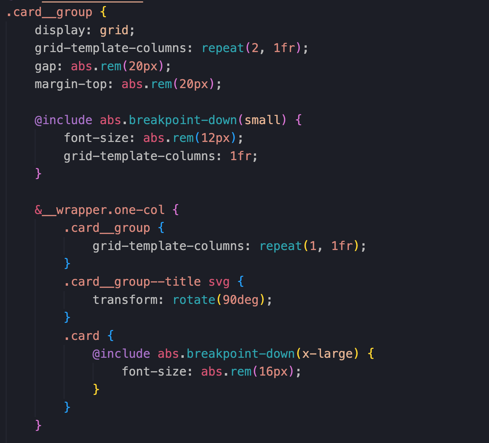
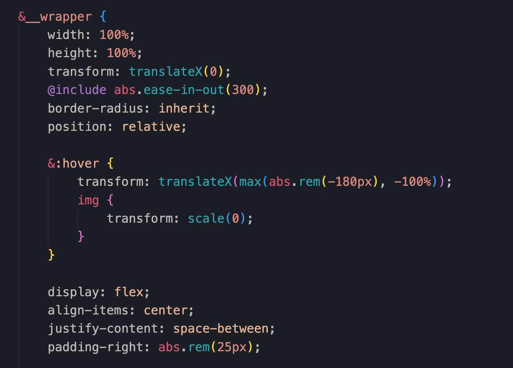

# Rivals - University Work
> Для просмотра стилей на странице рекомендуется см. в `sass/` директорию
## Project Structure
```
📦individual_work
 ┣ 📂css (generated styles)
 ┃ ┣ 📄authentication.css
 ┃ ┣ 📄authentication.css.map
 ┃ ┣ 📄challenges.css
 ┃ ┣ 📄challenges.css.map
 ┃ ┣ 📄main.css
 ┃ ┣ 📄main.css.map
 ┃ ┣ 📄workshop.css
 ┃ ┗ 📄workshop.css.map
 ┣ 📂img
 ┃ ┣ 📄arrow.svg
 ┃ ┣ 📄bell.svg
 ┃ ┣ 📄cols.svg
 ┃ ┣ 📄door.svg
 ┃ ┣ 📄favicon.png
 ┃ ┣ 📄link.svg
 ┃ ┣ 📄logo.svg
 ┃ ┣ 📄star.svg
 ┃ ┗ 📄user.svg
 ┣ 📂js
 ┃ ┗ 📄main.js
 ┣ 📂pages
 ┃ ┣ 📄authentication.html
 ┃ ┣ 📄challenges.html
 ┃ ┗ 📄workshop.html
 ┣ 📂sass (preprocessing)
 ┃ ┣ 📂abstracts
 ┃ ┃ ┣ 📄_functions.scss
 ┃ ┃ ┣ 📄_index.scss
 ┃ ┃ ┗ 📄_mixins.scss
 ┃ ┣ 📂base
 ┃ ┃ ┣ 📄_globals.scss
 ┃ ┃ ┣ 📄_index.scss
 ┃ ┃ ┗ 📄_reset.scss
 ┃ ┣ 📂components
 ┃ ┃ ┣ 📄_activities.scss
 ┃ ┃ ┣ 📄_card-group.scss
 ┃ ┃ ┣ 📄_challenges.scss
 ┃ ┃ ┣ 📄_forms.scss
 ┃ ┃ ┣ 📄_index.scss
 ┃ ┃ ┣ 📄_info.scss
 ┃ ┃ ┣ 📄_navbar.scss
 ┃ ┃ ┗ 📄_notifications.scss
 ┃ ┣ 📂layout
 ┃ ┃ ┣ 📄_container.scss
 ┃ ┃ ┣ 📄_header.scss
 ┃ ┃ ┣ 📄_index.scss
 ┃ ┃ ┗ 📄_main.scss
 ┃ ┣ 📂pages
 ┃ ┃ ┣ 📄authentication.scss
 ┃ ┃ ┣ 📄challenges.scss
 ┃ ┃ ┗ 📄workshop.scss
 ┃ ┣ 📂themes
 ┃ ┃ ┗ 📄_pulse.scss
 ┃ ┗ 📄main.scss
 ┣ 📄README.md
 ┗ 📄index.html (Main Page)
 ```

## What is used
- HTML5
    - semantic html markup
- CSS3
    - variables
    - grid
    - flex
    - media
    - desktop-first workflow
- JS
- SASS/SCSS
    - mixins
    - functions
    - module structure
- SVG

## Some details
Сетка из заданий сделана при помощи `display: grid` с необязательным классом `one-col` для одной колонны кард. Адаптированно при помощи `media`-выражений.

Эффект выползающей информации был достигнут при помощи `overflow: hidden` и `transform: translateX()`, состояние которого меняется при наведении курсора.
